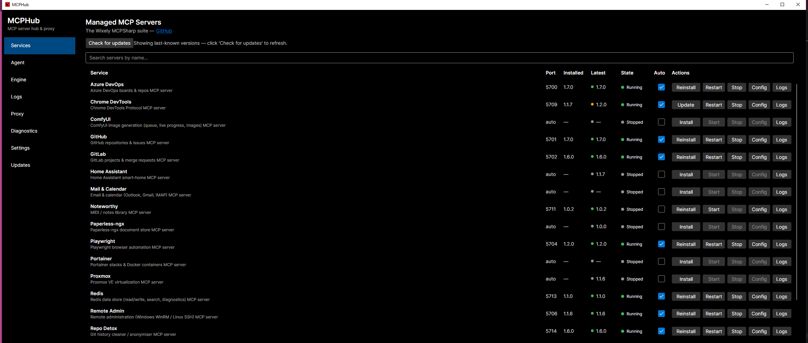
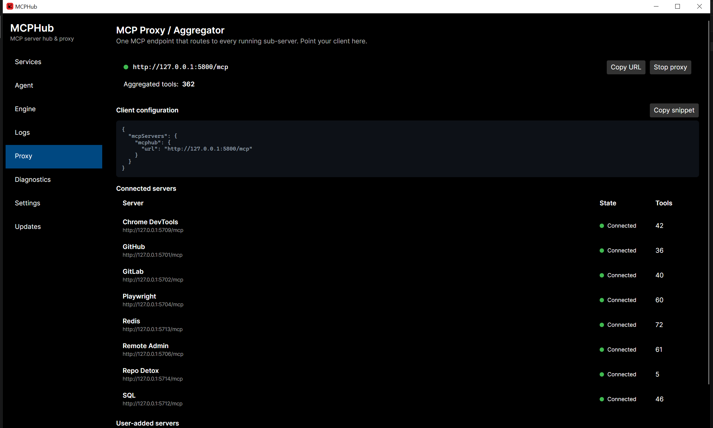
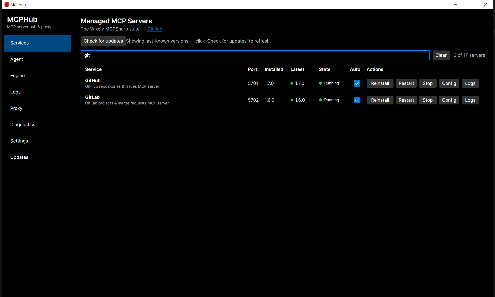
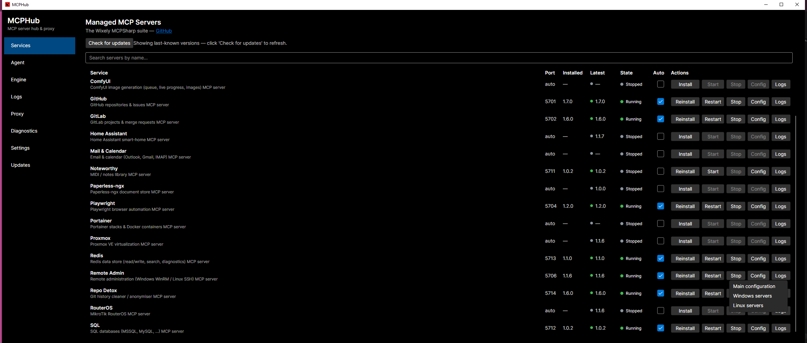
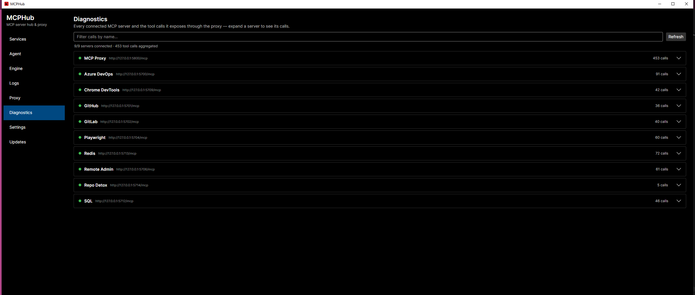
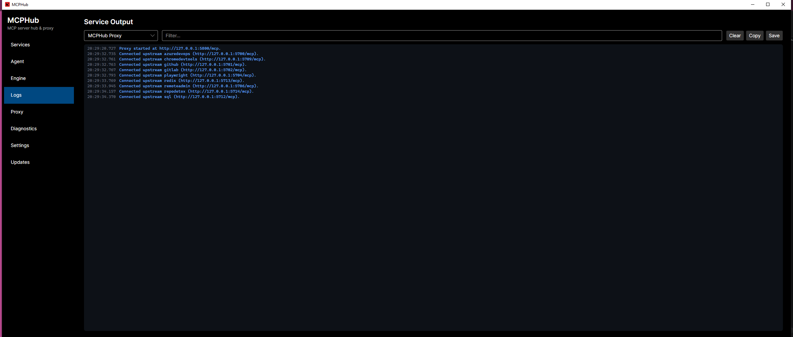
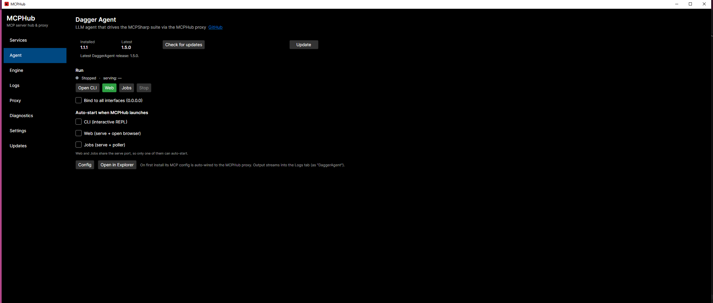
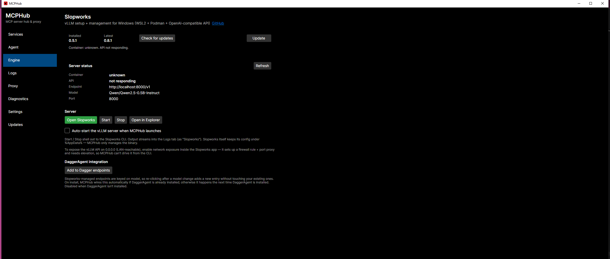
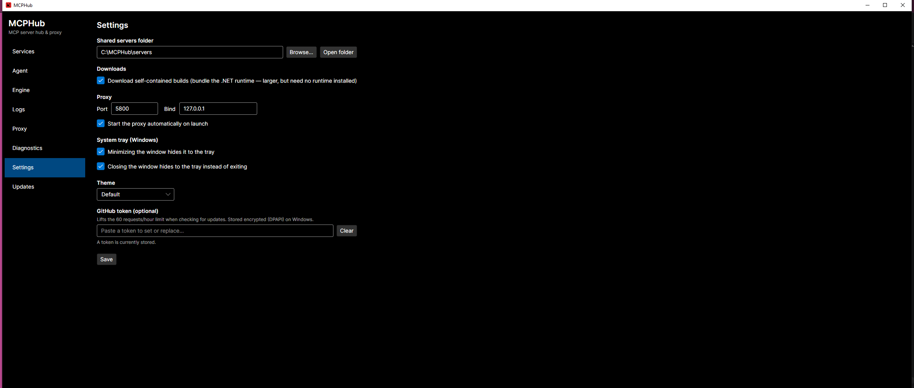

# MCPHub

**One app to install, run and update the MCPSharp servers — and one URL to point your AI client at.**

MCPSharp is a suite of MCP (Model Context Protocol) servers that let an AI assistant do real work: query your databases, drive a browser, manage GitHub and GitLab, administer remote machines, control Docker, read your mail. Each one is a separate program with its own version, config file and port.

Running a handful of them by hand gets old quickly. MCPHub does it for you.



## Why you'd want it

- **Install with one click.** MCPHub fetches the right release from GitHub and unpacks it. No zips, no PATH, no guessing which build you need.
- **Keeps everything up to date.** It checks each server's latest release and shows you a coloured dot when one is behind.
- **Starts servers for you.** Tick *Auto* and a server comes up whenever MCPHub launches, quietly in the background.
- **One endpoint instead of fifteen.** The built-in proxy aggregates every running server behind a single URL, so your AI client needs one line of config no matter how many servers you run.
- **No runtime to install.** The self-contained builds bundle everything they need.

## Install

Download the latest release for your platform from the [Releases page](https://github.com/Wixely/MCPHub/releases), unzip it anywhere, and run `MCPHub`.

There's no installer and nothing is written outside your own user folders.

## First run

1. **Open MCPHub.** You land on the **Services** page, listing every server it knows about.
2. **Install what you want.** Click **Install** on a row. A progress bar replaces the buttons; when it finishes the version appears under *Installed*.
3. **Start it.** Click **Start**. The state dot goes amber (*Starting*) then green (*Running*).
4. **Tick *Auto*** on anything you want up automatically next time.
5. **Go to the Proxy page** and copy the client snippet into your AI client's config.

That's it. You don't need to know any server's port — the proxy handles routing.

## One endpoint for your AI client

The **Proxy** page is the important one. It runs a single MCP endpoint that forwards to every server you have running, namespacing each one's tools so nothing collides.



Click **Copy snippet** and paste it into your client:

```json
{
  "mcpServers": {
    "mcphub": {
      "url": "http://127.0.0.1:5800/mcp"
    }
  }
}
```

Add or remove servers later and your client config never changes — the proxy picks them up as they start and stop.

## The pages

### Services

Everything MCPHub manages, one row each. The **search box** above the list narrows it as you type — by display name or product name, so both `mail` and `mailcal` find Mail & Calendar.



| Column | Meaning |
| --- | --- |
| **Port** | The port this server listens on, read from its own config file. `auto` until it's installed, because that's when the config arrives. |
| **Installed** | The version you have, or `—` if it isn't installed. |
| **Latest** | The newest release on GitHub. The dot is green when you're current, amber when an update is waiting. |
| **State** | Grey *Stopped*, amber *Starting*, green *Running*, red if it faulted. |
| **Auto** | Start this server automatically when MCPHub launches. |

The buttons:

| Button | Does |
| --- | --- |
| **Install** / **Update** / **Reinstall** | Label follows what's needed. Your config is preserved. |
| **Start** / **Restart** | Starts a stopped server. Once it's running the same button reads **Restart** and stops then starts it — which is what you want after editing a config. |
| **Stop** | Stops it without starting again. |
| **Config** | Opens that server's JSON in your editor. Servers that read more than one config file (Remote Admin) get a dropdown listing all of them. |
| **Logs** | Jumps to the Logs page filtered to this server. |

**Check for updates** refreshes the *Latest* column for everything at once. MCPHub remembers the answer, so it doesn't hit GitHub every time you open it.



> **First time opening an extra config file?** Some servers ship their secondary files as `.example.json` templates so an update can never overwrite your real data. Picking one from the Config dropdown renames the template into place and opens it, pre-filled with the right shape.

### Diagnostics

Every connected server and the tool calls it exposes through the proxy. This is where you confirm your client really can see what you think it can — expand a server to list its calls, or filter by name across all of them.



### Logs

Output from any server, or from the proxy itself. Pick a source, filter the lines, and **Copy** or **Save** when you need to send someone the evidence.



This is the first place to look when a server won't start.

### Recipes

A small knowledge base of *"if X then Y"* notes on how to combine servers to finish a task no single server can. The canonical example: Kodi's tools are useless until Kodi is running — but on Android, ADB can launch it, and on a Windows or Linux box, Remote Admin can start it. Once an agent works that out, it can save the combination as a recipe ("Access Kodi") and never rediscover it.

Recipes are server-agnostic — a recipe just names the server keys involved (`kodi`, `adb`, `remoteadmin`, or any user-added server). Agents read and write them through the proxy:

| Tool | Does |
| --- | --- |
| `recipes__list` | All recipes, optionally filtered by `query` text or `service` key |
| `recipes__get` | One recipe by id |
| `recipes__add` | Save a new recipe: `title`, `when`, `then`, `services`, optional `notes` |
| `recipes__update` | Change some fields of an existing recipe |
| `recipes__remove` | Delete one |

The proxy also tells connecting clients (via the MCP `instructions` field) that recipes exist and when to consult them, so an agent checks before a multi-server task rather than after it fails.

The page lets you curate the same store by hand: search, add, edit and delete, with a live view of what agents have saved. Recipes are deliberately short — the fields are size-limited — and live in `recipes.json` beside your settings, so they can be backed up or edited directly.

Two checkboxes at the top of the page decide what agents may do. They take effect immediately; disabled tools simply disappear from the proxy's tool list.

| Checkbox | Off means | Headless / Docker flag |
| --- | --- | --- |
| **Let agents use recipes** | No `recipes__*` tools are exposed at all. The page still works for you. | `MCPHUB_RECIPES_ENABLED=false` |
| **Let agents add and edit recipes** | Agents get `recipes__list` and `recipes__get` only — they can consult recipes but not change them. | `MCPHUB_RECIPES_AGENT_EDIT=false` |

The environment variables win over the checkboxes when set (`true`/`false`, `1`/`0`, `yes`/`no`, `on`/`off`), so a container can pin the policy with `-e MCPHUB_RECIPES_AGENT_EDIT=false`; the page then shows the checkbox locked and says which variable is pinning it.

### Agent

[DaggerAgent](https://github.com/Wixely/DaggerAgent) is an LLM agent that drives the whole suite through the proxy. Install it here and MCPHub wires it to the proxy for you. Run it as an interactive CLI, a web UI, or a background job poller.



### Engine

[Slopworks](https://github.com/Wixely/Slopworks) runs a local vLLM server with an OpenAI-compatible API, so the agent can use a model on your own machine instead of a hosted one. MCPHub shows whether the container and API are healthy and can add the endpoint to DaggerAgent for you.



### Settings



| Setting | What it does |
| --- | --- |
| **Shared servers folder** | Where servers are installed. Change it to put them on another drive. |
| **Download self-contained builds** | On by default. Bundles the .NET runtime — bigger downloads, but nothing to install. Turn it off only if you already have the .NET runtime. |
| **Proxy port / bind** | The aggregated endpoint. `127.0.0.1` keeps it on this machine; change the bind address to reach it from your network. |
| **Agent management** | Off by default. Lets agents on the proxy list, start/stop/restart, install/update and check updates for the managed servers through `mcphub__*` tools — see [Letting agents manage servers](#letting-agents-manage-servers). Applies immediately, no Save needed. |
| **System tray** | Whether minimising and closing hide to the tray instead of exiting. |
| **GitHub token** | Optional. Lifts GitHub's 60-requests-per-hour limit on update checks. Stored encrypted (DPAPI on Windows). |

## The servers it manages

| Server | Port | What it's for |
| --- | --- | --- |
| [Azure DevOps](https://github.com/Wixely/AzureDevopsMCPSharp) | 5700 | Boards, repos, pipelines and wikis |
| [GitHub](https://github.com/Wixely/GithubMCPSharp) | 5701 | Repositories, issues, pull requests, Actions |
| [GitLab](https://github.com/Wixely/GitlabMCPSharp) | 5702 | Projects, merge requests, pipelines |
| [Home Assistant](https://github.com/Wixely/HomeAssistantMCPSharp) | 5703 | Smart-home entities and automations |
| [Playwright](https://github.com/Wixely/PlaywrightMCPSharp) | 5704 | Cross-browser automation |
| [Proxmox](https://github.com/Wixely/ProxmoxMCPSharp) | 5705 | Virtual machines and containers |
| [Remote Admin](https://github.com/Wixely/RemoteAdminMCPSharp) | 5706 | Windows (WinRM) and Linux (SSH) administration |
| [RouterOS](https://github.com/Wixely/RouterOSMCPSharp) | 5707 | MikroTik router management |
| [Paperless-ngx](https://github.com/Wixely/PaperlessNgxMCPSharp) | 5708 | Search and manage a document archive |
| [Chrome DevTools](https://github.com/Wixely/ChromeDevToolsMCPSharp) | 5709 | Drive Chrome via the DevTools Protocol |
| [Noteworthy](https://github.com/Wixely/NoteworthyMCPSharp) | 5711 | Create and edit MIDI music files |
| [SQL](https://github.com/Wixely/SQLMCPSharp) | 5712 | MSSQL, MySQL, Oracle and SQLite |
| [Kodi](https://github.com/Wixely/KodiMCPSharp) | 5712 | Browse and control Kodi media centres |
| [Redis](https://github.com/Wixely/RedisMCPSharp) | 5713 | Read, write, search and diagnose Redis |
| [Repo Detox](https://github.com/Wixely/RepoDetox) | 5714 | Clean secrets and history out of git repos |
| [ComfyUI](https://github.com/Wixely/ComfyUIMCPSharp) | 5715 | Image generation with live progress |
| [Portainer](https://github.com/Wixely/PortainerMCPSharp) | 5716 | Docker stacks and containers via Portainer |
| [Mail & Calendar](https://github.com/Wixely/MailCalMCPSharp) | 5717 | Outlook, Gmail and IMAP mail plus calendars |
| [Bambu Lab](https://github.com/Wixely/BambuMCPSharp) | 5718 | Bambu Lab X1-series printers in LAN mode |
| [ADB](https://github.com/Wixely/ADBMCPSharp) | 21990 | Guarded Android Debug Bridge device access |

These are each server's shipped default. MCPHub doesn't assume them — it reads the port from the
server's own config after install, so changing one there is all it takes and the Services list
follows.

Most servers need configuring before they're useful — a connection string, an API token, the address of the thing they talk to. Click **Config** on the row to open that server's JSON, then **Stop** and **Start** it to pick up the change. Each server's own README documents its settings.

> **A note on safety.** Servers that can change things ship **read-only by default**. Deleting a stack, dropping a table or restarting a machine stays blocked until you explicitly turn it on in that server's config. This is deliberate — check the server's README before you loosen it.

## Letting agents manage servers

An agent talking to the proxy can also be allowed to manage the servers behind it — bring up the one whose tools it needs, apply an update, or tell you a newer MCPHub is out. **This is off by default**: turn it on under **Settings → Agent management**, where one master switch and three capability switches decide what agents get. They take effect immediately; tools an agent may not use simply disappear from the proxy's tool list.

| Switch | Grants | Headless / Docker flag |
| --- | --- | --- |
| **Let agents manage servers** | `mcphub__list_services` — every managed server with its install state, versions, run state and port. Everything below needs this on. | `MCPHUB_AGENT_MANAGEMENT_ENABLED=true` |
| **Start, stop and restart servers** | `mcphub__start`, `mcphub__stop`, `mcphub__restart` | `MCPHUB_AGENT_MANAGEMENT_CONTROL=false` |
| **Install and update servers** | `mcphub__install`, `mcphub__update` | `MCPHUB_AGENT_MANAGEMENT_INSTALL=false` |
| **Check GitHub for server and MCPHub updates** | `mcphub__check_service_updates`, `mcphub__check_hub_update` | `MCPHUB_AGENT_MANAGEMENT_UPDATE_CHECKS=false` |

As with recipes, an environment variable wins over the checkbox when set (`true`/`false`, `1`/`0`, `yes`/`no`, `on`/`off`), and the page shows the checkbox locked with the variable that is pinning it.

| Tool | Does |
| --- | --- |
| `mcphub__list_services` | Lists every server. Optional `query` narrows by name or key. |
| `mcphub__start` | Starts an installed server and waits (`wait_seconds`, default 30) for it to report healthy. Its tools then appear in the proxy. |
| `mcphub__stop` | Stops a running server. |
| `mcphub__restart` | Stop then start — the usual move after you have edited a server's config. |
| `mcphub__install` | Installs a server that is not installed, from its latest GitHub release. `start: true` brings it up afterwards. Refuses if already installed. |
| `mcphub__update` | Checks for a newer release and installs it, preserving your config and restarting the server if it was running. Does nothing when up to date unless `force: true`. |
| `mcphub__check_service_updates` | Checks GitHub for one server or all of them. Installs nothing. |
| `mcphub__check_hub_update` | Compares the running MCPHub with its newest release. MCPHub never replaces itself — the agent is told to give you the release page URL. |

Every server is addressed by its key (`kodi`, the prefix on its tool names), its product name (`KodiMCPSharp`) or its display name. Operations on the same server are serialised, so an agent cannot start what it is halfway through updating. Anything an agent does is written to that server's log, so the Logs page shows who drove a change.

What agents **cannot** do through these tools, by design: read or edit a server's config files, or read logs. If a server won't start, the agent is told to ask you — the Logs page is yours.

The proxy's MCP `instructions` describe the granted capabilities to a connecting client, so an agent knows it can start a stopped server rather than reporting its tools as missing.

## Updating

**Check for updates** on the Services page refreshes every row. Where an update is waiting the button becomes **Update**; click it and MCPHub stops the server, replaces the binaries, keeps your config, and starts it again if it was running.

MCPHub updates itself the same way from the **Updates** page.

## Where things live

| | |
| --- | --- |
| Installed servers | The *Shared servers folder* from Settings |
| Your settings | Your user config folder, under `MCPHub` |
| Recipes | `recipes.json`, beside your settings |
| Logs | Beside the installed servers, in `logs` |
| Single-instance lock | `mcphub.lock` in your user data folder |

Each server keeps its config in a `<ServerName>.json` next to its executable, so updating never overwrites your settings.

## Troubleshooting

**A server won't start.** Open **Logs**, pick that server, and read the last few lines. The usual causes are a missing setting in its config or a port already in use.

**MCPHub won't open and no window appears.** It is already running — check the notification area for the tray icon, since **Close to tray** keeps it alive after you close the window. Only one MCPHub may run at a time: it binds a fixed proxy port, starts each service on its own fixed port, and writes to a shared servers folder, so a second instance would fight the first for all three. A second launch exits immediately with code `2` and explains itself on standard error, which you will see if you started it from a terminal.

If you genuinely want another instance — testing a new build against an old one, say — pass `--allow-multiple-instances`. Nothing else is changed by that switch: both instances will still compete for the proxy port and the servers folder, so point the second one at a different port and folder in **Settings** first.

The lock is an exclusive lock the operating system holds on `mcphub.lock` for as long as the process lives. It is released even if MCPHub is killed, so a leftover `mcphub.lock` file never blocks a restart and should not be deleted by hand.

**Two servers fighting over a port.** Each server's port lives in its own JSON under `Server` → `Port`. Change one, then stop and start it.

**"Couldn't reach GitHub."** Update checks are rate-limited to 60 an hour without a token. Add a GitHub token in **Settings** to lift it — read-only public access is enough.

**My client can't see any tools.** Check the **Proxy** page shows the proxy running and at least one server *Connected*. A server has to be **Running** on the Services page before the proxy will pick it up.

**Nothing is listed as Connected.** Servers connect a moment after they start. If a server sits at *Starting* it's failing its health check — check its logs.

## Licence

MIT. See [LICENSE](LICENSE).
